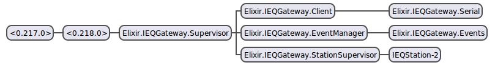

# IEQ (Indoor Environmental Quality) Gateway

**A Client for the [RFM69-USB-Gateway](https://github.com/NationalAssociationOfRealtors/RFM69-USB-Gateway) and [Indoor Air Quality Sensor](https://github.com/NationalAssociationOfRealtors/IndoorAirQualitySensor)**

## Use

    1. git clone https://github.com/NationalAssociationOfRealtors/ieq_gateway.git
    2. mix do deps.get, deps.compile
    3. iex -S mix

## Explanation

As a new sensor array starts broadcasting, a process is started to parse and store the state of the sensor array. Each update triggers an event notification over `IEQGateway.Events` event bus. You can add a handler to the event bus by calling `IEQGateway.EventManager.add_handler`. To see an example implementation of a handler look at `IEQGateway.Handler` and also be sure to look at the tests.

An event is the state of a sensor array which looks like this.

    %IEQGateway.IEQStation.State{
        battery: 0,
        co: 39.0,
        co2: 450.0,
        door: 0,
        energy: 0,
        humidity: 35.4,
        id: :"IEQStation-2",
        light: 216.0,
        motion: 0,
        no2: 0.0,
        pm: 0,
        pressure: 29.96,
        rssi: -27.0,
        sound: 526.0,
        temperature: 31.6,
        uv: 0,
        voc: 125.0
    }

Different nodes on the network will report different values, the state represents all possible values.

## Architecture

`IEQGateway.Client` is a small Serial client. It is the main interface for sending and receiving messages. As a new IEQ(Indoor Environmental Quality) station is discovered a process is spawned through `IEQGateway.StationSupervisor` and the station processes' state represents the station's attributes.

Every 8 seconds the station sends updated attribute information, the station process (`IEQGateway.IEQStation`) parses the data and updates it's state, the state is then broadcast (using notify) over `IEQGateway.Events` event bus. Anyone can add a handler to the event bus to handle updated station state by calling `IEQGateway.EventManager.add_handler`. See `IEQGateway.Handler` for an example implementation of an event handler.
